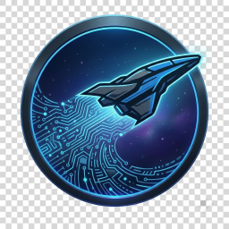

<div align="center">
  

  # UEX Datarunner
  *Windows desktop client for submitting Star Citizen commodity data to UEX using local AI OCR*

  [](https://github.com/oovz/uex-datarunner/actions)
  [](LICENSE)

  [Features](#features) • [Prerequisites](#prerequisites) • [Quick Start](#quick-start) • [Development](#development)
</div>

---

UEX Datarunner is a Windows desktop application that automates the extraction and submission of Star Citizen commodity terminal pricing data to [uexcorp.space](https://uexcorp.space). 

By utilizing local AI vision models (such as Qwen-3.5 via the local Foundry AI runtime), it processes screenshots directly on your machine to extract terminal inventory levels, buy/sell prices, and quantities without requiring external cloud OCR APIs.

> This application currently supports **commodity** only.

## Features

- 🧠 **Local AI OCR**: Runs state-of-the-art vision models locally via the Foundry Local SDK. Fully offline OCR processing that uses your NVIDIA GPU to capture terminal contents with high accuracy.
- 🔄 **Cache Synchronization**: Auto-fetches and caches commodity details, terminal listings, and game version parameters from the UEX API.
- 🎯 **Smart Data Resolution**: Matches extracted names against the UEX commodity database and helps resolve ambiguous matches.
- 💾 **Durable Sessions**: Persists scanned records locally so your session remains intact even if the app minimizes to the system tray or restarts.
- 📥 **Interactive Review**: Preview, edit, filter, or delete screenshot records before submitting.
- 📤 **Submissions Control**: Validate and adjust extracted prices, select the terminal location, and submit in Test or Production modes.
- 🪟 **System Tray Integration**: Minimizes to the system tray when closed to keep the application active and ready for background usage.

## Prerequisites

### Hardware & Software
- **Operating System**: Windows 10 or 11
- **GPU**: NVIDIA GPU with CUDA support (required for running the local AI vision model)
- **Runtime**: NVIDIA drivers and active CUDA runtime installed

### Accounts & API Access
- A valid [UEX Account](https://uexcorp.space) with submit permission
- Your private UEX API **Secret Key** (accessible from your UEX user profile)

## Quick Start

1. Download the latest installer (`.exe`) from the [GitHub Releases](https://github.com/oovz/uex-datarunner/releases) page.
2. Install and launch the application.
3. Open **Settings** to set your **Star Citizen screenshot directory** and your **UEX Secret Key**.
4. Take screenshots of commodity trading terminals in Star Citizen (using the default `PrintScreen` key).
5. Select the screenshots in the main view and click **Run OCR**.
6. Review the extracted pricing data, resolve any commodity names, select the trading terminal, and click **Submit to UEX**.

<details>
<summary><b>Development, Local Run & Contribution Guide</b></summary>

## Development

To set up the project locally for development or testing:

### Prerequisites
- [Node.js](https://nodejs.org/) (v20+)
- [pnpm](https://pnpm.io/) (v9+)
- [Rust](https://www.rust-lang.org/) stable toolchain with the `x86_64-pc-windows-msvc` target

### Setup & Dev
```bash
# Clone the repository
git clone https://github.com/oovz/uex-datarunner.git
cd uex-datarunner

# Install dependencies
pnpm install

# Run the app in development mode
pnpm tauri dev
```

### Testing
```bash
# Run frontend unit and integration tests
pnpm test:unit

# Run backend Rust tests
pnpm test:rust

# Run end-to-end tests (requires Playwright installation)
npx playwright install
pnpm test:e2e
```

</details>

## License

This project is licensed under the [MIT License](LICENSE).
